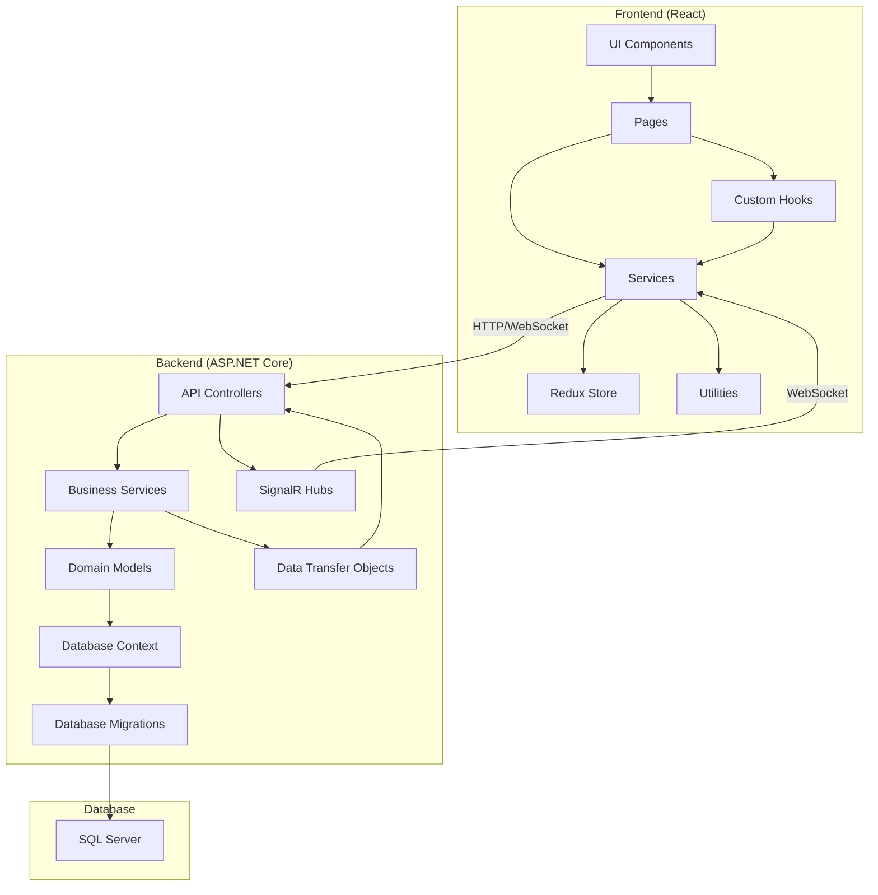
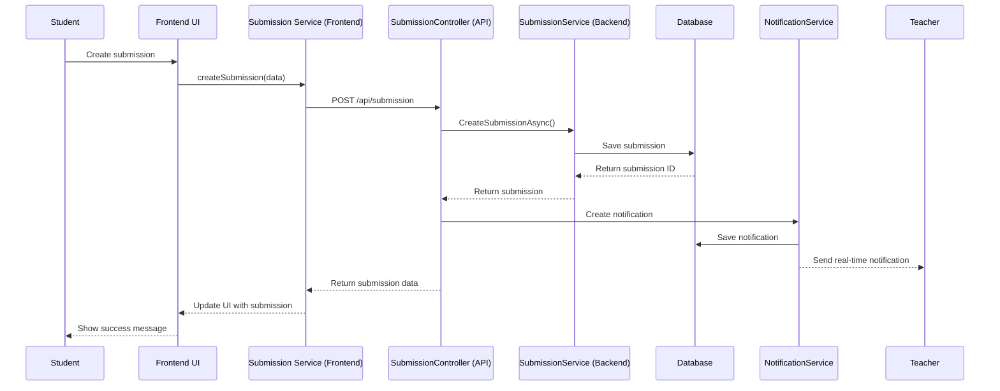

# TehtavaApp System Architecture

This document provides a detailed overview of the TehtavaApp system architecture, including component relationships, design patterns, and technical decisions.

## System Overview

TehtavaApp is built using a modern, layered architecture that separates concerns and promotes maintainability and scalability. The system consists of:

1. **Frontend**: React-based single-page application (SPA)
2. **Backend**: ASP.NET Core API
3. **Database**: SQL Server relational database
4. **Real-time Communication**: SignalR for notifications and updates

## Architecture Diagram

## Backend Architecture

### Design Patterns

The backend follows several design patterns:

1. **Repository Pattern**: Abstracts data access logic
2. **Dependency Injection**: Promotes loose coupling and testability
3. **DTO Pattern**: Separates domain models from API contracts
4. **Service Layer Pattern**: Encapsulates business logic
5. **Unit of Work**: Manages database transactions

### Component Breakdown

#### Controllers

Controllers handle HTTP requests and responses. They:
- Validate input
- Call appropriate services
- Return appropriate HTTP status codes and responses
- Handle authorization

Key controllers include:
- `AuthController`: Handles authentication and authorization
- `CourseController`: Manages course-related operations
- `AssignmentController`: Handles assignment creation and management
- `SubmissionController`: Processes student submissions and grading
- `MaterialController`: Manages educational materials
- `NotificationController`: Handles notification operations
- `UserController`: Manages user profiles and settings
- `GroupController`: Handles student group operations
- `AdminController`: Provides administrative functions

#### Services

Services implement business logic and orchestrate operations. They:
- Implement business rules
- Coordinate data access
- Handle complex operations
- Manage transactions

Key services include:
- `TokenService`: Handles JWT token generation and validation
- `CourseService`: Implements course-related business logic
- `AssignmentService`: Manages assignment operations
- `SubmissionService`: Handles submission processing and grading
- `MaterialService`: Manages file uploads and educational materials
- `NotificationService`: Handles notification creation and delivery
- `UserService`: Manages user-related operations
- `GroupService`: Implements group management logic
- `AdminService`: Provides administrative functions

#### Models

Domain models represent the core business entities:
- `ApplicationUser`: Extends IdentityUser with application-specific properties
- `Course`: Represents an educational course
- `Assignment`: Represents a task assigned to students
- `AssignmentSubmission`: Represents a student's submission for an assignment
- `Material`: Represents educational materials or uploaded files
- `SchoolGroup`: Represents a group of students
- `StudentGroupEnrollment`: Represents a student's enrollment in a group
- `Notification`: Represents a system notification
- `NotificationPreference`: Represents user preferences for notifications

#### Data Access

Data access is handled through Entity Framework Core:
- `ApplicationDbContext`: Defines the database schema and relationships
- Migrations: Handle database schema evolution
- Configuration: Sets up entity relationships and constraints

## Frontend Architecture

### Design Patterns

The frontend follows several design patterns:

1. **Component-Based Architecture**: Modular UI components
2. **Service Pattern**: Encapsulates API calls and data processing
3. **Hooks Pattern**: Manages state and side effects
4. **Container/Presentational Pattern**: Separates data handling from presentation

### Component Breakdown

#### Core Components

- `App`: Main application component
- `Layout`: Defines the overall UI structure
- `Routes`: Manages application routing
- `AuthProvider`: Handles authentication state
- `ThemeProvider`: Manages application theming

#### Pages

- `Dashboard`: Main landing page after login
- `Courses`: Lists available courses
- `CourseDetail`: Shows detailed course information
- `Assignments`: Lists assignments
- `AssignmentDetail`: Shows detailed assignment information
- `Submissions`: Lists submissions
- `SubmissionDetail`: Shows detailed submission information
- `GradingPage`: Interface for grading submissions
- `Profile`: User profile management
- `Admin`: Administrative interface

#### Reusable Components

- `Header`: Application header with navigation
- `Sidebar`: Navigation sidebar
- `CourseCard`: Displays course information
- `AssignmentCard`: Displays assignment information
- `SubmissionForm`: Form for submitting assignments
- `SubmissionViewer`: Displays submission content
- `EnhancedFeedback`: Rich feedback interface
- `RichTextEditor`: WYSIWYG editor for rich text
- `InlineCommentMarker`: Highlights text with comments
- `FileUploader`: Handles file uploads
- `Notifications`: Displays user notifications

#### Services

- `authService`: Handles authentication operations
- `courseService`: Manages course-related API calls
- `assignmentService`: Handles assignment operations
- `submissionService`: Manages submission operations
- `feedbackService`: Handles feedback-related operations
- `inlineCommentService`: Manages inline comments
- `fileUploadService`: Handles file uploads
- `notificationService`: Manages notifications
- `userService`: Handles user-related operations

## Communication Flow

### Submission Flow Example

## Authentication and Authorization

The system uses JWT (JSON Web Tokens) for authentication:

1. User logs in with credentials
2. Server validates credentials and issues a JWT
3. Client stores the JWT and includes it in subsequent requests
4. Server validates the JWT for each protected endpoint

Authorization is role-based:
- **Students**: Can view courses, submit assignments, view their submissions
- **Teachers**: Can create courses, assignments, grade submissions
- **Administrators**: Have full system access

## File Storage

Files are stored on the server's file system:
- Uploads are stored in a configurable directory
- Files are organized by submission ID
- File metadata is stored in the database
- Files are served through a dedicated endpoint

## Real-time Notifications

Real-time notifications are implemented using SignalR:
1. Server-side hub manages connections
2. Clients connect to the hub on login
3. Server sends notifications to specific users or groups
4. Clients display notifications in real-time

## Scalability Considerations

The architecture supports horizontal scaling:
- Stateless API can be deployed across multiple servers
- Database can be scaled independently
- File storage can be moved to a distributed system
- SignalR supports scale-out with backplane

## Security Considerations

The system implements several security measures:
- JWT-based authentication
- Role-based authorization
- Input validation
- HTTPS for all communications
- Secure file handling
- Protection against common web vulnerabilities 