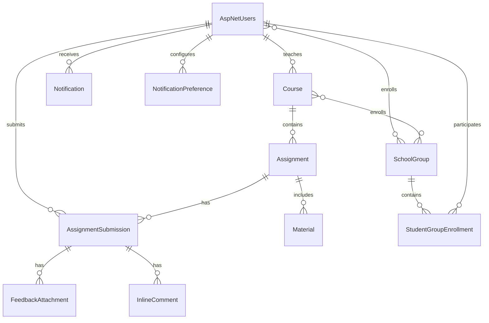

# TehtavaApp Database Schema

This document provides a detailed overview of the TehtavaApp database schema, including tables, relationships, and key fields.

## Database Overview

TehtavaApp uses a SQL Server database with Entity Framework Core as the ORM (Object-Relational Mapper). The database schema is designed to support the educational platform's core functionalities, including user management, course management, assignments, submissions, and notifications.

## Entity Relationship Diagram

## Core Tables

### AspNetUsers

The `AspNetUsers` table extends the ASP.NET Core Identity framework's user table with application-specific fields.

| Column | Type | Description |
|--------|------|-------------|
| Id | nvarchar(450) | Primary key |
| UserName | nvarchar(256) | User's login name |
| NormalizedUserName | nvarchar(256) | Normalized username for searching |
| Email | nvarchar(256) | User's email address |
| NormalizedEmail | nvarchar(256) | Normalized email for searching |
| EmailConfirmed | bit | Whether email is confirmed |
| PasswordHash | nvarchar(max) | Hashed password |
| SecurityStamp | nvarchar(max) | Security stamp for validation |
| ConcurrencyStamp | nvarchar(max) | Concurrency stamp |
| PhoneNumber | nvarchar(max) | User's phone number |
| PhoneNumberConfirmed | bit | Whether phone is confirmed |
| TwoFactorEnabled | bit | Whether 2FA is enabled |
| LockoutEnd | datetimeoffset | When lockout ends |
| LockoutEnabled | bit | Whether lockout is enabled |
| AccessFailedCount | int | Failed access attempts |
| FirstName | nvarchar(100) | User's first name |
| LastName | nvarchar(100) | User's last name |
| StudentNumber | nvarchar(50) | Student identification number |
| ProfilePictureUrl | nvarchar(max) | URL to profile picture |
| UserType | int | Type of user (Student, Teacher, Admin) |
| CreatedAt | datetime2 | When user was created |
| UpdatedAt | datetime2 | When user was last updated |

### Course

The `Course` table stores information about educational courses.

| Column | Type | Description |
|--------|------|-------------|
| Id | uniqueidentifier | Primary key |
| Name | nvarchar(100) | Course name |
| Code | nvarchar(20) | Course code |
| Description | nvarchar(max) | Course description |
| StartDate | datetime2 | Course start date |
| EndDate | datetime2 | Course end date |
| TeacherId | nvarchar(450) | Foreign key to AspNetUsers |
| CreatedAt | datetime2 | When course was created |
| UpdatedAt | datetime2 | When course was last updated |
| IsArchived | bit | Whether course is archived |

### Assignment

The `Assignment` table stores information about tasks assigned to students.

| Column | Type | Description |
|--------|------|-------------|
| Id | uniqueidentifier | Primary key |
| Title | nvarchar(100) | Assignment title |
| Description | nvarchar(max) | Assignment description |
| DueDate | datetime2 | Assignment due date |
| CourseId | uniqueidentifier | Foreign key to Course |
| MaxPoints | decimal(5,2) | Maximum points possible |
| IsPublished | bit | Whether assignment is published |
| CreatedAt | datetime2 | When assignment was created |
| UpdatedAt | datetime2 | When assignment was last updated |
| AllowLateSubmissions | bit | Whether late submissions are allowed |
| LateSubmissionDeadline | datetime2 | Deadline for late submissions |
| LateSubmissionPenalty | decimal(5,2) | Penalty for late submissions |

### AssignmentSubmission

The `AssignmentSubmission` table stores student submissions for assignments.

| Column | Type | Description |
|--------|------|-------------|
| Id | uniqueidentifier | Primary key |
| AssignmentId | uniqueidentifier | Foreign key to Assignment |
| StudentId | nvarchar(450) | Foreign key to AspNetUsers |
| SubmissionDate | datetime2 | When submission was made |
| Content | nvarchar(max) | Submission content |
| Grade | decimal(5,2) | Assigned grade |
| Feedback | nvarchar(max) | Teacher feedback |
| Status | int | Submission status (Draft, Submitted, Graded) |
| IsLate | bit | Whether submission is late |
| CreatedAt | datetime2 | When submission was created |
| UpdatedAt | datetime2 | When submission was last updated |

### Material

The `Material` table stores educational materials and resources.

| Column | Type | Description |
|--------|------|-------------|
| Id | uniqueidentifier | Primary key |
| Title | nvarchar(100) | Material title |
| Description | nvarchar(max) | Material description |
| FileUrl | nvarchar(max) | URL to file |
| FileType | nvarchar(50) | Type of file |
| FileSize | bigint | Size of file in bytes |
| AssignmentId | uniqueidentifier | Foreign key to Assignment |
| CourseId | uniqueidentifier | Foreign key to Course |
| UploadedById | nvarchar(450) | Foreign key to AspNetUsers |
| CreatedAt | datetime2 | When material was created |
| UpdatedAt | datetime2 | When material was last updated |

### SchoolGroup

The `SchoolGroup` table stores information about student groups.

| Column | Type | Description |
|--------|------|-------------|
| Id | uniqueidentifier | Primary key |
| Name | nvarchar(100) | Group name |
| Description | nvarchar(max) | Group description |
| CourseId | uniqueidentifier | Foreign key to Course |
| CreatedAt | datetime2 | When group was created |
| UpdatedAt | datetime2 | When group was last updated |

### StudentGroupEnrollment

The `StudentGroupEnrollment` table manages the many-to-many relationship between students and groups.

| Column | Type | Description |
|--------|------|-------------|
| Id | uniqueidentifier | Primary key |
| StudentId | nvarchar(450) | Foreign key to AspNetUsers |
| GroupId | uniqueidentifier | Foreign key to SchoolGroup |
| EnrollmentDate | datetime2 | When student was enrolled |
| CreatedAt | datetime2 | When enrollment was created |
| UpdatedAt | datetime2 | When enrollment was last updated |

### Notification

The `Notification` table stores system notifications.

| Column | Type | Description |
|--------|------|-------------|
| Id | uniqueidentifier | Primary key |
| UserId | nvarchar(450) | Foreign key to AspNetUsers |
| Title | nvarchar(100) | Notification title |
| Message | nvarchar(max) | Notification message |
| Type | int | Notification type |
| IsRead | bit | Whether notification is read |
| RelatedEntityId | uniqueidentifier | Related entity ID |
| RelatedEntityType | nvarchar(50) | Related entity type |
| CreatedAt | datetime2 | When notification was created |
| UpdatedAt | datetime2 | When notification was last updated |

### NotificationPreference

The `NotificationPreference` table stores user preferences for notifications.

| Column | Type | Description |
|--------|------|-------------|
| Id | uniqueidentifier | Primary key |
| UserId | nvarchar(450) | Foreign key to AspNetUsers |
| NotificationType | int | Type of notification |
| EmailEnabled | bit | Whether email notifications are enabled |
| PushEnabled | bit | Whether push notifications are enabled |
| InAppEnabled | bit | Whether in-app notifications are enabled |
| CreatedAt | datetime2 | When preference was created |
| UpdatedAt | datetime2 | When preference was last updated |

### FeedbackAttachment

The `FeedbackAttachment` table stores attachments associated with feedback.

| Column | Type | Description |
|--------|------|-------------|
| Id | uniqueidentifier | Primary key |
| SubmissionId | uniqueidentifier | Foreign key to AssignmentSubmission |
| FileName | nvarchar(255) | Name of file |
| FilePath | nvarchar(max) | Path to file |
| FileType | nvarchar(50) | Type of file |
| FileSize | bigint | Size of file in bytes |
| UploadedById | nvarchar(450) | Foreign key to AspNetUsers |
| CreatedAt | datetime2 | When attachment was created |
| UpdatedAt | datetime2 | When attachment was last updated |

### InlineComment

The `InlineComment` table stores inline comments on submissions.

| Column | Type | Description |
|--------|------|-------------|
| Id | uniqueidentifier | Primary key |
| SubmissionId | uniqueidentifier | Foreign key to AssignmentSubmission |
| TeacherId | nvarchar(450) | Foreign key to AspNetUsers |
| Text | nvarchar(max) | Comment text |
| StartPosition | int | Start position in text |
| EndPosition | int | End position in text |
| ReferenceId | nvarchar(100) | Reference identifier |
| ReferenceText | nvarchar(max) | Referenced text |
| StartLine | int | Start line number |
| EndLine | int | End line number |
| CreatedAt | datetime2 | When comment was created |
| UpdatedAt | datetime2 | When comment was last updated |

## Key Relationships

1. **User to Course**: One-to-many relationship where a teacher can create multiple courses.
2. **Course to Assignment**: One-to-many relationship where a course can have multiple assignments.
3. **Assignment to Submission**: One-to-many relationship where an assignment can have multiple submissions.
4. **User to Submission**: One-to-many relationship where a student can make multiple submissions.
5. **Course to Group**: One-to-many relationship where a course can have multiple groups.
6. **User to Group**: Many-to-many relationship where students can be in multiple groups and groups can have multiple students.
7. **Submission to Feedback**: One-to-many relationship where a submission can have multiple feedback attachments and inline comments.

## Indexes

The database includes several indexes to optimize query performance:

1. Primary key indexes on all tables
2. Foreign key indexes for relationships
3. Indexes on frequently queried fields such as:
   - User email and username
   - Course code
   - Assignment due date
   - Submission date
   - Notification read status

## Constraints

The database enforces several constraints to maintain data integrity:

1. **Foreign Key Constraints**: Ensure referential integrity between related tables
2. **Unique Constraints**: Prevent duplicate entries for fields like course codes
3. **Check Constraints**: Validate data ranges (e.g., grades between 0 and max points)
4. **Default Constraints**: Set default values for fields like creation timestamps

## Database Migrations

The database schema is managed through Entity Framework Core migrations, which provide:

1. Version control for the database schema
2. Automated schema updates
3. Rollback capability
4. Seed data for initial setup

Migrations are stored in the `Migrations` folder and can be applied using the `dotnet ef database update` command. 