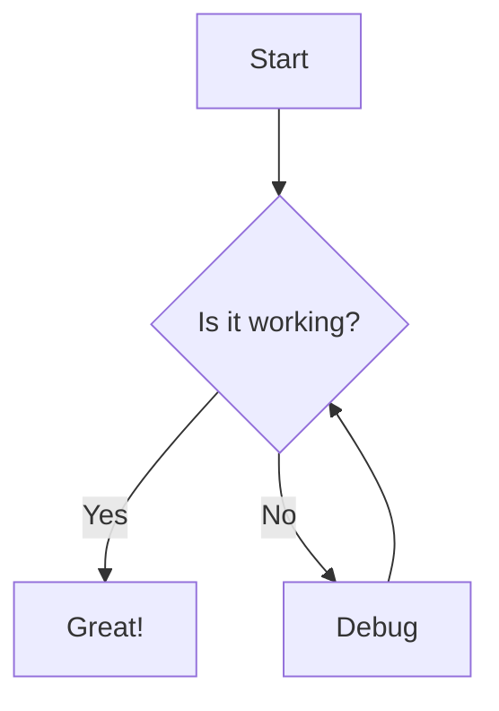
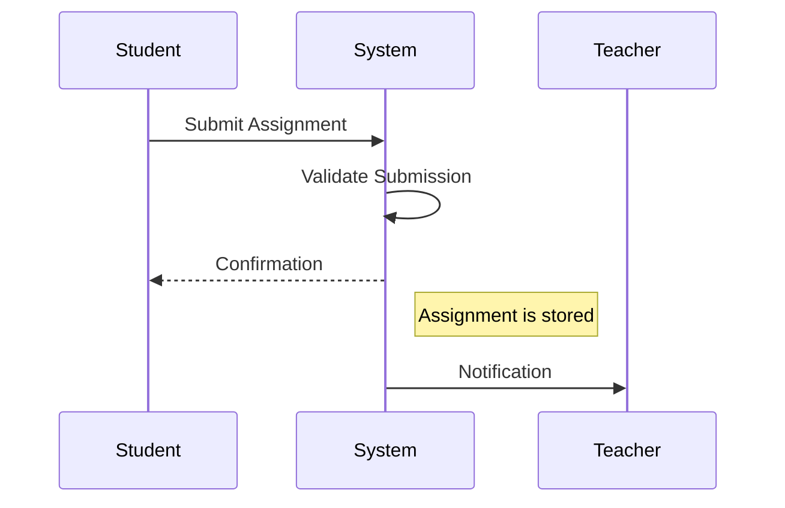
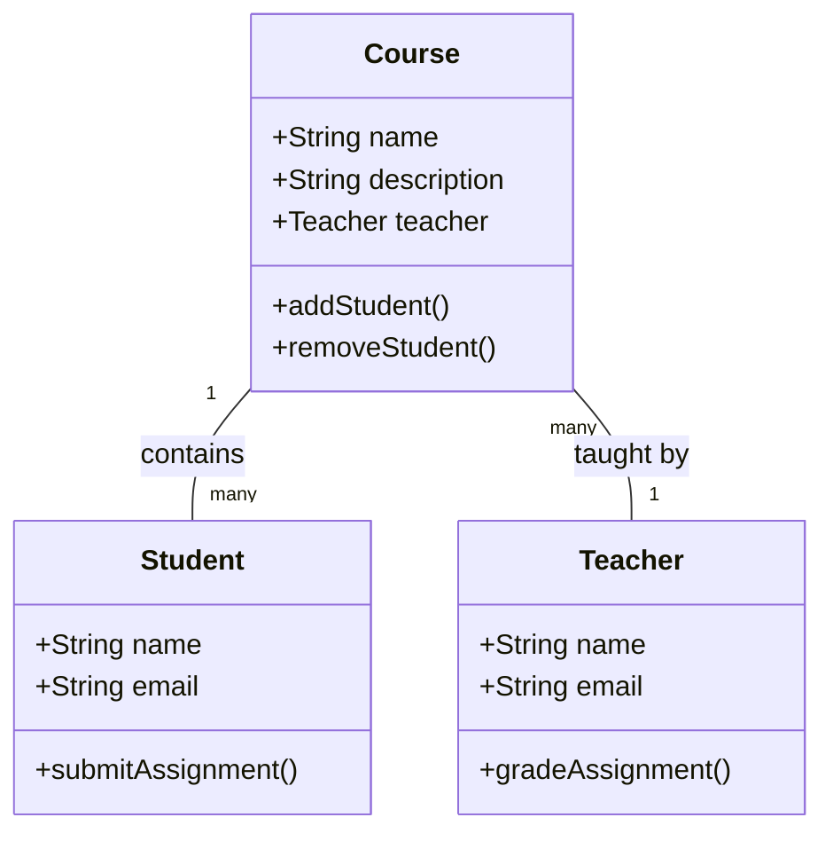
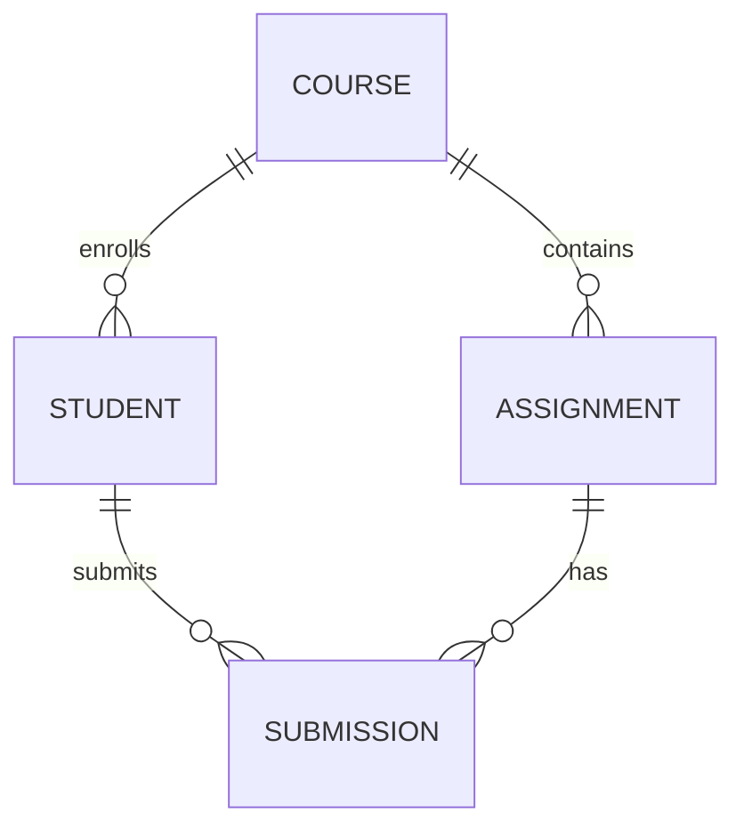
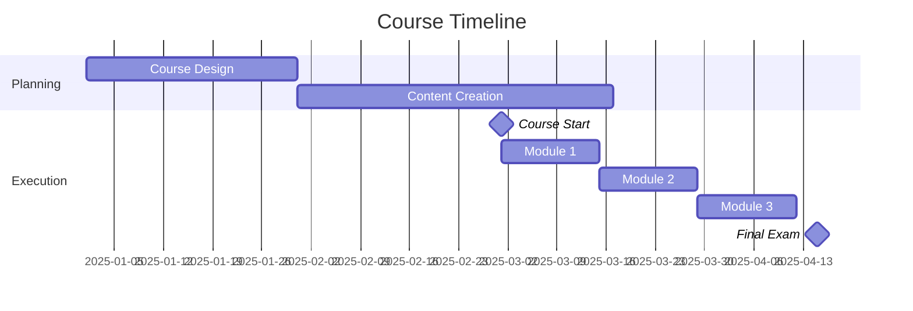

# Markdown with LaTeX and Mermaid Support

This document provides examples of how to use LaTeX and Mermaid diagrams in your course materials.

## LaTeX Examples

You can include mathematical expressions using LaTeX syntax enclosed in dollar signs for inline math or double dollar signs for block math.

### Inline Math

Inline math expressions can be written like this: $E = mc^2$

### Block Math

Block math expressions are centered and displayed on their own line:

$$
\frac{d}{dx}(x^n) = nx^{n-1}
$$

$$
\int_{a}^{b} f(x) \, dx = F(b) - F(a)
$$

$$
\sum_{i=1}^{n} i = \frac{n(n+1)}{2}
$$

### More Complex Examples

Maxwell's Equations:

$$
\begin{aligned}
\nabla \times \vec{E} &= -\frac{\partial \vec{B}}{\partial t} \\
\nabla \times \vec{B} &= \mu_0 \vec{J} + \mu_0 \varepsilon_0 \frac{\partial \vec{E}}{\partial t} \\
\nabla \cdot \vec{E} &= \frac{\rho}{\varepsilon_0} \\
\nabla \cdot \vec{B} &= 0
\end{aligned}
$$

Matrix:

$$
\begin{pmatrix}
a & b & c \\
d & e & f \\
g & h & i
\end{pmatrix}
$$

## Mermaid Diagram Examples

Mermaid diagrams can be included using the mermaid code block syntax.

### Flowchart

### Sequence Diagram

### Class Diagram

### Entity Relationship Diagram

### Gantt Chart

## Combining LaTeX and Markdown

You can combine LaTeX and regular markdown formatting:

**The quadratic formula** is given by:

$$x = \frac{-b \pm \sqrt{b^2 - 4ac}}{2a}$$

Where:
- $a$, $b$, and $c$ are coefficients in the quadratic equation $ax^2 + bx + c = 0$
- The discriminant $\Delta = b^2 - 4ac$ determines the number of solutions

## Tips for Using LaTeX and Mermaid

1. For LaTeX:
   - Use `$...$` for inline math
   - Use `$$...$$` for block math
   - Escape special characters with a backslash
   - Use `\begin{aligned}...\end{aligned}` for multi-line equations

2. For Mermaid:
   - Use triple backticks followed by "mermaid" to start a diagram
   - End with triple backticks
   - Different diagram types have different syntax
   - Refer to the [Mermaid documentation](https://mermaid.js.org/intro/) for more examples
