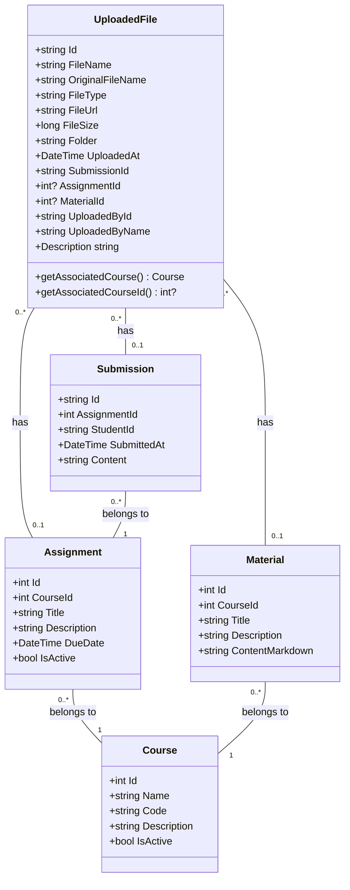

# Data Model Documentation

This document provides a comprehensive overview of the TehtavaApp data model, focusing on file storage and relationships between entities.

## Entity Relationships

The application uses a relational database model with the following key entities and relationships:

### Core Entities

- **UploadedFile**: Represents files uploaded to the system
- **Assignment**: Represents course assignments
- **Material**: Represents course materials
- **Course**: Represents academic courses
- **ApplicationUser**: Represents users in the system

## File Storage Model

Files in the system are stored using both database records (metadata) and actual file content storage (either local filesystem or Azure Blob Storage).

### UploadedFile Entity

The `UploadedFile` entity is central to the file management system and has the following key attributes:

```csharp
public class UploadedFile
{
    // Primary key
    public string Id { get; set; } = Guid.NewGuid().ToString();
    
    // File metadata
    public string FileName { get; set; }
    public string OriginalFileName { get; set; }
    public string FileType { get; set; }
    public string FileUrl { get; set; }
    public long FileSize { get; set; }
    public string Folder { get; set; } = "uploads";
    public DateTime UploadedAt { get; set; } = DateTime.UtcNow;
    public DateTime CreatedAt { get; set; } = DateTime.UtcNow;
    public bool IsStoredInCloud { get; set; }
    
    // Storage information
    public string Path { get; set; }
    public string Url { get; set; }
    
    // Uploader information
    public string UploadedById { get; set; }
    public string UploadedByName { get; set; }
    
    // Optional descriptive metadata
    public string Description { get; set; }
    
    // Relationships - Foreign Keys
    public string SubmissionId { get; set; }
    public int? AssignmentId { get; set; }
    public int? MaterialId { get; set; }
    
    // Navigation properties
    public virtual Assignment Assignment { get; set; }
    public virtual Material Material { get; set; }
    
    // Helper properties (not mapped to database)
    public Course AssociatedCourse => Assignment?.Course ?? Material?.Course;
    public int? AssociatedCourseId => Assignment?.CourseId ?? Material?.CourseId;
}
```

## Key Relationships

### UploadedFile to Assignment (Many-to-One)

- An `UploadedFile` can be associated with one `Assignment` (optional)
- An `Assignment` can have many `UploadedFile` entries
- The relationship is established via the `AssignmentId` foreign key in `UploadedFile`
- `AssignmentId` is of type `int?` to match the primary key type of `Assignment`

### UploadedFile to Material (Many-to-One)

- An `UploadedFile` can be associated with one `Material` (optional)
- A `Material` can have many `UploadedFile` entries
- The relationship is established via the `MaterialId` foreign key in `UploadedFile`
- `MaterialId` is of type `int?` to match the primary key type of `Material`

### UploadedFile to Course (Indirect Relationship)

- An `UploadedFile` does not have a direct relationship to a `Course`
- The relationship is established indirectly through either:
  - The `Assignment` entity (Assignment → Course)
  - The `Material` entity (Material → Course)
- Helper properties in the `UploadedFile` class provide convenient access to the associated course

### UploadedFile to Submission (Many-to-One)

- An `UploadedFile` can be associated with one `Submission` (optional)
- A `Submission` can have many `UploadedFile` entries
- The relationship is established via the `SubmissionId` foreign key in `UploadedFile`

## Database Configuration

The relationships are configured in the `ApplicationDbContext` class:

```csharp
// UploadedFile to Assignment
modelBuilder.Entity<UploadedFile>()
    .HasOne(f => f.Assignment)
    .WithMany(a => a.Files)
    .HasForeignKey(f => f.AssignmentId)
    .OnDelete(DeleteBehavior.SetNull);

// UploadedFile to Material
modelBuilder.Entity<UploadedFile>()
    .HasOne(f => f.Material)
    .WithMany(m => m.Files)
    .HasForeignKey(f => f.MaterialId)
    .OnDelete(DeleteBehavior.SetNull);
```

## File Storage Strategy

- **Cloud Storage**: Files can be stored in Azure Blob Storage with metadata in the database
- **Folder Structure**: Files are organized in folders based on their associated entities:
  - `/courses/{courseId}/materials/` for course materials
  - `/courses/{courseId}/assignments/` for assignment files
  - `/submissions/{submissionId}/` for submission files

## Migration History

The database schema has evolved through several migrations, including:

- **20250430000000_UpdateUploadedFilesRelationships**: Changed `AssignmentId` and `MaterialId` from `string` to `int?` type to match the primary key types of their respective entities, removed direct `CourseId` column, and established indirect relationships to courses through assignments and materials.

## Implementation Notes

- `OnDelete(DeleteBehavior.SetNull)` ensures that if an assignment or material is deleted, the associated files are not deleted but instead have their foreign key set to null.
- Helper properties like `AssociatedCourse` and `AssociatedCourseId` simplify accessing course information through the navigation properties.
- The `IsStoredInCloud` property indicates whether the file is stored in Azure Blob Storage or locally.

## Entity Diagram

(See Mermaid diagram below for visual representation)



## API Endpoints

### File Upload Endpoints

- **POST /api/files/upload**: Uploads a single file with optional parameters:
  - `file`: The file to upload
  - `folder`: The folder to upload to (default: "general")
  - `assignmentId`: Optional assignment ID to associate the file with
  - `materialId`: Optional material ID to associate the file with
  - `courseId`: Optional course ID for folder structure

- **POST /api/files/bulk-upload/{courseId}**: Uploads multiple files for a course
  - `courseId`: The ID of the course
  - `files`: The collection of files to upload

### File Retrieval Endpoints

- **GET /api/files/{id}**: Gets a file by ID
- **GET /api/files/assignment/{assignmentId}**: Gets files associated with an assignment
- **GET /api/files/submission/{submissionId}**: Gets files associated with a submission
- **GET /api/files/folder/{folder}**: Gets files in a specific folder

## Frontend Integration

The frontend uses the following services to interact with file uploads:

```typescript
// TypeScript interface for UploadedFile
export interface UploadedFile {
  id: string;
  fileName: string;
  fileType: string;
  fileUrl: string;
  fileSize: number;
  uploadedAt: string;
  assignmentId?: number;
  materialId?: number;
  folder?: string;
  submissionId?: string;
}

// Methods for uploading files
async uploadFileForAssignment(file: File, assignmentId: number, folder?: string, courseId?: string): Promise<UploadedFile>
async uploadFileForMaterial(file: File, materialId: number, folder?: string, courseId?: string): Promise<UploadedFile>
async getFilesByAssignmentId(assignmentId: number): Promise<UploadedFile[]>
```

## Security Considerations

- All file uploads are authenticated and authorized
- File types are restricted based on configurable allowed extensions
- File sizes are limited based on configurable maximum size
- Folder names are sanitized to prevent path traversal attacks
- Files are stored with unique generated filenames to prevent collisions 