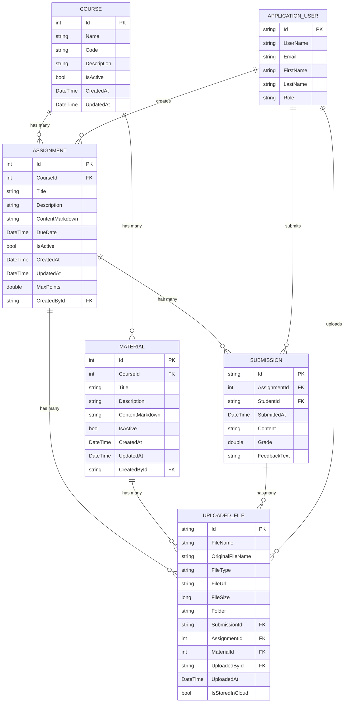

# Database Relationships Documentation

This document outlines the database relationships in the TehtavaApp application, with a specific focus on the file storage system and its connections to other entities.

## Entity Relationship Diagram

The following diagram illustrates the relationships between the core entities in the database:



## Key Relationship Details

### Files and Related Entities

The `UploadedFile` entity is central to the file management system and has relationships with several other entities:

#### UploadedFile → Assignment

```csharp
// In UploadedFile class
public int? AssignmentId { get; set; }
public virtual Assignment Assignment { get; set; }

// In Assignment class
public ICollection<UploadedFile> Files { get; set; }

// In DbContext configuration
modelBuilder.Entity<UploadedFile>()
    .HasOne(f => f.Assignment)
    .WithMany(a => a.Files)
    .HasForeignKey(f => f.AssignmentId)
    .OnDelete(DeleteBehavior.SetNull);
```

- **Relationship Type**: Many-to-One
- **Foreign Key**: `AssignmentId` (int?) in `UploadedFile`
- **Delete Behavior**: SetNull (when an assignment is deleted, the file remains but the AssignmentId is set to null)

#### UploadedFile → Material

```csharp
// In UploadedFile class
public int? MaterialId { get; set; }
public virtual Material Material { get; set; }

// In Material class
public ICollection<UploadedFile> Files { get; set; }

// In DbContext configuration
modelBuilder.Entity<UploadedFile>()
    .HasOne(f => f.Material)
    .WithMany(m => m.Files)
    .HasForeignKey(f => f.MaterialId)
    .OnDelete(DeleteBehavior.SetNull);
```

- **Relationship Type**: Many-to-One
- **Foreign Key**: `MaterialId` (int?) in `UploadedFile`
- **Delete Behavior**: SetNull (when a material is deleted, the file remains but the MaterialId is set to null)

#### UploadedFile → Submission

```csharp
// In UploadedFile class
public string SubmissionId { get; set; }
```

- **Relationship Type**: Many-to-One
- **Foreign Key**: `SubmissionId` (string) in `UploadedFile`

#### UploadedFile → Course (Indirect)

The `UploadedFile` entity does not have a direct relationship with `Course`. Instead, this relationship is established indirectly through either:

1. `UploadedFile → Assignment → Course`
2. `UploadedFile → Material → Course`

```csharp
// Helper properties in UploadedFile class to access Course information
[NotMapped]
public Course AssociatedCourse => Assignment?.Course ?? Material?.Course;

[NotMapped]
public int? AssociatedCourseId => Assignment?.CourseId ?? Material?.CourseId;
```

These helper properties allow for convenient access to the associated course without requiring a direct database relationship.

### Course and Teaching Material Relationships

#### Course → Assignment

```csharp
// In Assignment class
public int CourseId { get; set; }
public Course Course { get; set; }

// In Course class
public ICollection<Assignment> Assignments { get; set; }
```

- **Relationship Type**: One-to-Many
- **Foreign Key**: `CourseId` (int) in `Assignment`

#### Course → Material

```csharp
// In Material class
public int CourseId { get; set; }
public Course Course { get; set; }

// In Course class
public ICollection<Material> Materials { get; set; }
```

- **Relationship Type**: One-to-Many
- **Foreign Key**: `CourseId` (int) in `Material`

### Assignment and Submission Relationships

#### Assignment → Submission

```csharp
// In Submission class
public int AssignmentId { get; set; }
public Assignment Assignment { get; set; }

// In Assignment class
public ICollection<AssignmentSubmission> Submissions { get; set; }
```

- **Relationship Type**: One-to-Many
- **Foreign Key**: `AssignmentId` (int) in `Submission`

## Data Flow

### File Upload Process

1. When a file is uploaded, it's associated with one of:
   - An Assignment (`AssignmentId`)
   - A Material (`MaterialId`)
   - A Submission (`SubmissionId`)

2. The file content is stored in:
   - Azure Blob Storage (if `IsStoredInCloud` is true)
   - Local file system (if `IsStoredInCloud` is false)

3. The metadata is stored in the `UploadedFiles` table:
   - The file URL points to the storage location
   - The folder structure includes information about the associated entity (e.g., `courses/{courseId}/assignments/`)

### File Retrieval Process

1. Files can be retrieved by:
   - Direct ID lookup
   - Associated entity (Assignment, Material, Submission)
   - Folder structure

2. When a file is requested, the system:
   - Retrieves the metadata from the database
   - Uses the stored URL to access the file content
   - Returns the file with appropriate content type

## Migrations

The database schema has evolved over time through several migrations. The most significant related to the file relationships is:

- **20250430000000_UpdateUploadedFilesRelationships**: 
  - Changed `AssignmentId` and `MaterialId` from `string` to `int?` type
  - Updated the foreign key constraints to match the primary key types
  - Added proper indexes and relationships
  - Removed the direct `CourseId` column in favor of indirect relationships

## Advanced Relationship Features

### Cascade Delete Behavior

The application uses `DeleteBehavior.SetNull` for the relationships between `UploadedFile` and its related entities (`Assignment` and `Material`). This means:

1. When an Assignment or Material is deleted, associated files are not deleted
2. The corresponding foreign key (`AssignmentId` or `MaterialId`) is set to null
3. This maintains file data integrity even when related entities are removed

### Lazy Loading

The navigation properties are configured for lazy loading with the `virtual` keyword:

```csharp
public virtual Assignment Assignment { get; set; }
public virtual Material Material { get; set; }
```

This means related entities are loaded from the database only when accessed, which improves performance for queries that don't need the related data.

## Performance Considerations

### Indexing

The database includes indexes on foreign key columns to improve query performance:

```csharp
// In migration
b.HasIndex("AssignmentId");
b.HasIndex("MaterialId");
```

### Query Optimization

The indirect relationship to Course might result in more complex queries. To optimize performance:

1. The helper properties (`AssociatedCourse`, `AssociatedCourseId`) make it easier to access course information
2. When querying files by course, it's more efficient to:
   - Query by folder structure (e.g., `courses/{courseId}/`)
   - Join through Assignment or Material in a single query

## Security Implications

The relationship model supports the application's security model by allowing:

1. Permission checks based on associated entities
2. Limiting file access based on user roles and relationships to courses
3. Maintaining appropriate access control even when files have multiple possible associations

## Conclusion

The database relationship model for the TehtavaApp application has been designed to:

1. Support flexible file associations with multiple entity types
2. Maintain data integrity through appropriate foreign key constraints
3. Provide efficient access to related data through navigation properties
4. Optimize for common query patterns while maintaining flexibility 