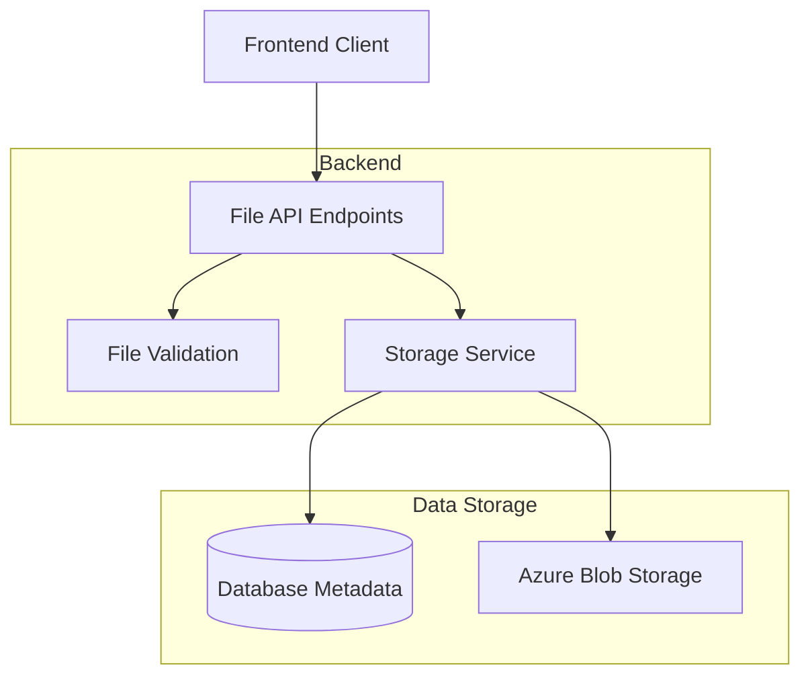
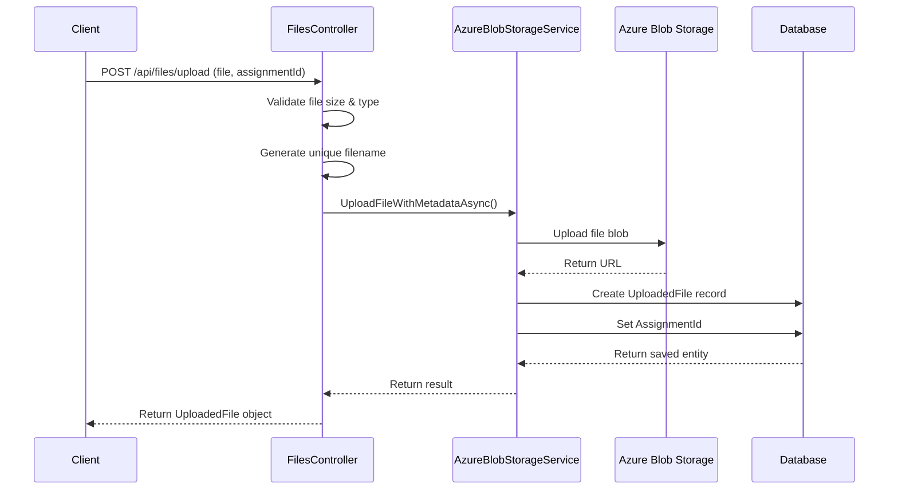
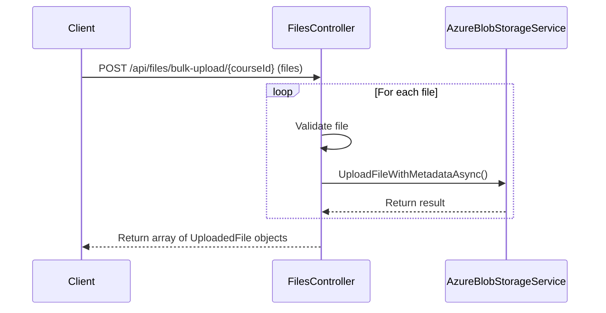
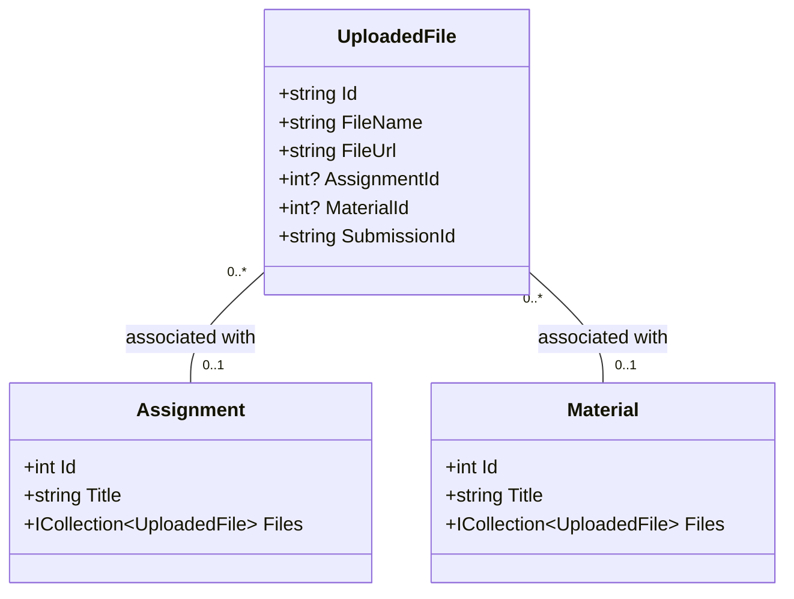

# File Upload System Documentation

This document provides technical details about the file upload system in TehtavaApp, including architecture, implementation, and usage guidelines.

## Architecture Overview

The file upload system consists of several components working together:



## Key Components

### 1. Frontend Upload Service

The `fileUploadService.ts` provides TypeScript methods for file uploads:

```typescript
export class FileUploadService {
  baseUrl: string = '/api/files';
  
  // Core upload methods
  async uploadFile(file: File, folder?: string, courseId?: string): Promise<UploadedFile>;
  async uploadFileForAssignment(file: File, assignmentId: number, folder?: string, courseId?: string): Promise<UploadedFile>;
  async uploadFileForMaterial(file: File, materialId: number, folder?: string, courseId?: string): Promise<UploadedFile>;
  
  // Bulk upload methods
  async bulkUpload(files: File[], courseId: string): Promise<UploadedFile[]>;
  
  // Retrieval methods
  async getFilesByAssignmentId(assignmentId: number): Promise<UploadedFile[]>;
  async getFile(fileId: string): Promise<UploadedFile>;
}
```

### 2. Backend Storage Services

The backend implements several service interfaces:

```csharp
// Core interfaces
public interface IFileReader { /* Methods for reading files */ }
public interface IFileWriter { /* Methods for writing files */ }
public interface IFileUrlGenerator { /* Methods for generating URLs */ }

// Combined service interface
public interface IFileStorageService : IFileReader, IFileWriter, IFileUrlGenerator {
    // File upload with metadata
    Task<UploadedFile> UploadFileWithMetadataAsync(Stream fileStream, string fileName, 
        string contentType, string folder, string originalFileName);
    
    // File retrieval methods
    Task<UploadedFile> GetFileByIdAsync(string id);
    Task<IEnumerable<UploadedFile>> GetFilesByAssignmentAsync(int assignmentId);
    Task<IEnumerable<UploadedFile>> GetFilesByMaterialAsync(int materialId);
    Task<IEnumerable<UploadedFile>> GetFilesBySubmissionAsync(string submissionId);
    Task<IEnumerable<UploadedFile>> GetFilesByFolderAsync(string folder);
    
    // File management methods
    Task<bool> DeleteFileByIdAsync(string id);
    Task<bool> UpdateFileAsync(UploadedFile file);
    Task<bool> AssociateFileWithSubmissionAsync(string fileId, string submissionId);
}
```

### 3. Azure Blob Storage Implementation

The `AzureBlobStorageService` class implements the `IFileStorageService` interface using Azure Blob Storage:

```csharp
public class AzureBlobStorageService : IFileStorageService {
    private readonly BlobContainerClient _containerClient;
    private readonly ApplicationDbContext _dbContext;
    private readonly ILogger<AzureBlobStorageService> _logger;
    private readonly bool _useCdn;
    private readonly string _cdnBaseUrl;
    
    // Methods implementation...
}
```

## File Upload Process

### Single File Upload

1. **Frontend Preparation**:
   - Client selects a file
   - Frontend wraps the file in FormData and sends to the appropriate endpoint

2. **Backend Processing**:
   - Validate file (size, type)
   - Generate unique filename
   - Upload to Azure Blob Storage
   - Store metadata in database with relationships
   - Return upload result



### Bulk Upload

1. **Frontend Preparation**:
   - Client selects multiple files
   - Frontend uses `bulkUpload` method to send files to the endpoint

2. **Backend Processing**:
   - Process each file in a loop
   - Return results for all successfully uploaded files



## Data Model Integration

The file upload system integrates with the data model through relationships:



## File Storage Organization

Files are organized in a hierarchical folder structure:

```
/
├── courses/
│   ├── {courseId}/
│   │   ├── assignments/
│   │   │   └── {assignment files}
│   │   └── materials/
│   │       └── {material files}
├── submissions/
│   ├── {submissionId}/
│   │   └── {submission files}
└── uploads/
    └── {general files}
```

## Configuration

### Azure Blob Storage Configuration

```json
{
  "AzureBlobStorage": {
    "ConnectionString": "DefaultEndpointsProtocol=https;AccountName=...;AccountKey=...;EndpointSuffix=core.windows.net",
    "ContainerName": "tehtavaapp-files",
    "UseCdn": true,
    "CdnBaseUrl": "https://cdn.example.com/tehtavaapp-files"
  },
  "FileStorage": {
    "MaxFileSizeBytes": 10485760,
    "AllowedExtensions": [".jpg", ".jpeg", ".png", ".gif", ".pdf", ".doc", ".docx", ".xls", ".xlsx", ".txt", ".md"]
  }
}
```

### Upload Size Limits

- Default maximum file size: 10 MB
- Configurable through `FileStorage:MaxFileSizeBytes` setting

### Allowed File Types

- Default allowed extensions: common image, document, and text formats
- Configurable through `FileStorage:AllowedExtensions` setting

## Security Considerations

### Authentication and Authorization

- All file upload endpoints require authentication
- File operations verify appropriate permissions:
  - Teachers can upload files to assignments and materials
  - Students can upload files to their own submissions
  - Administrators have full access

### File Type Validation

- Whitelist of allowed file extensions
- Content type verification
- Protection against common file upload vulnerabilities

### Storage Security

- Azure Blob Storage with private access
- Unique randomly generated filenames
- Optional CDN configuration for read-only public access

## Error Handling

The file upload system implements comprehensive error handling:

```csharp
try {
    // File upload operations
}
catch (Exception ex) {
    _logger.LogError(ex, "Error message");
    return appropriate_error_response;
}
```

Common error scenarios include:

1. File too large
2. Unsupported file type
3. Storage service unavailable
4. Database errors
5. Permission denied

## Usage Examples

### Basic File Upload

```typescript
// Client-side code
const file = event.target.files[0];
try {
  const result = await fileUploadService.uploadFile(file, 'documents');
  console.log(`File uploaded with ID: ${result.id}`);
} catch (error) {
  console.error('Upload failed:', error);
}
```

### Assignment File Upload

```typescript
// Client-side code
const file = event.target.files[0];
const assignmentId = 123;
try {
  const result = await fileUploadService.uploadFileForAssignment(
    file, 
    assignmentId, 
    'assignments',
    courseId
  );
  console.log(`Assignment file uploaded: ${result.fileName}`);
} catch (error) {
  console.error('Upload failed:', error);
}
```

### Bulk Upload

```typescript
// Client-side code
const files = Array.from(event.target.files);
const courseId = "course-123";
try {
  const results = await fileUploadService.bulkUpload(files, courseId);
  console.log(`Uploaded ${results.length} files`);
} catch (error) {
  console.error('Bulk upload failed:', error);
}
```

## Troubleshooting

### Common Issues

1. **File Upload Fails with 413 Status**
   - File exceeds size limit
   - Check server and client upload size limits

2. **File Upload Fails with 415 Status**
   - Unsupported file type
   - Check allowed extensions configuration

3. **File Upload Fails with 500 Status**
   - Server-side error
   - Check server logs for details
   - Common causes: storage connection issues, database errors

4. **Files Not Appearing in Assignment**
   - Check if assignmentId is correct
   - Verify permissions for the current user

## Performance Optimization

- File uploads use streaming to minimize memory usage
- Azure Blob Storage client is optimized for parallel uploads
- Bulk uploads process files in sequence to prevent overwhelming the server

## Future Enhancements

1. **Chunked Uploads**
   - Support for resumable uploads
   - Better handling of large files

2. **Progress Tracking**
   - Real-time upload progress notifications

3. **Direct-to-Blob Uploads**
   - Generate SAS tokens for direct uploads to Azure
   - Offload upload bandwidth from application server

4. **Advanced File Processing**
   - Image resizing and optimization
   - Virus scanning
   - PDF text extraction 